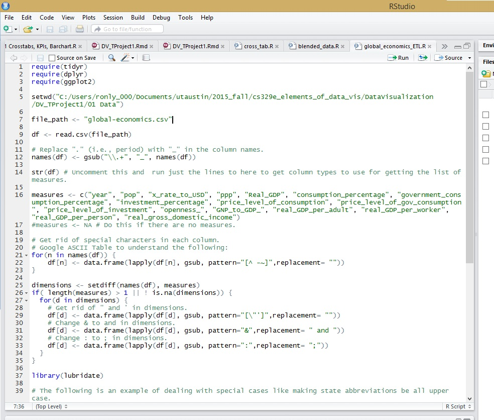
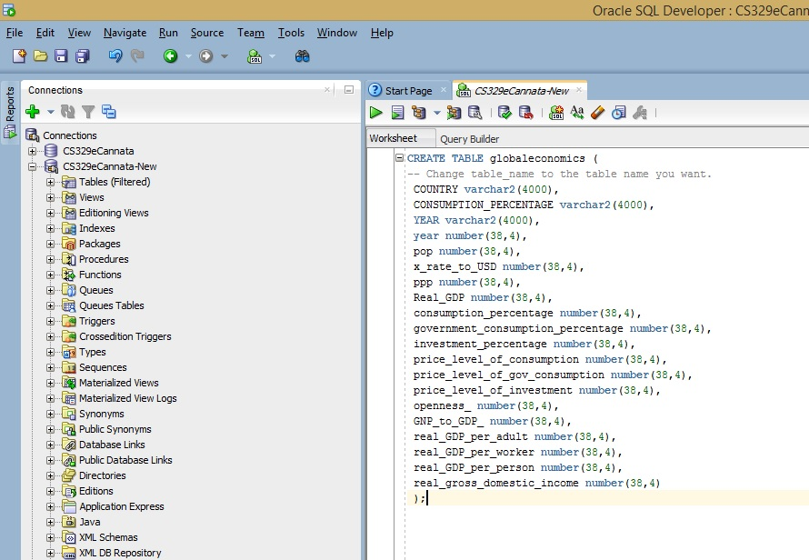
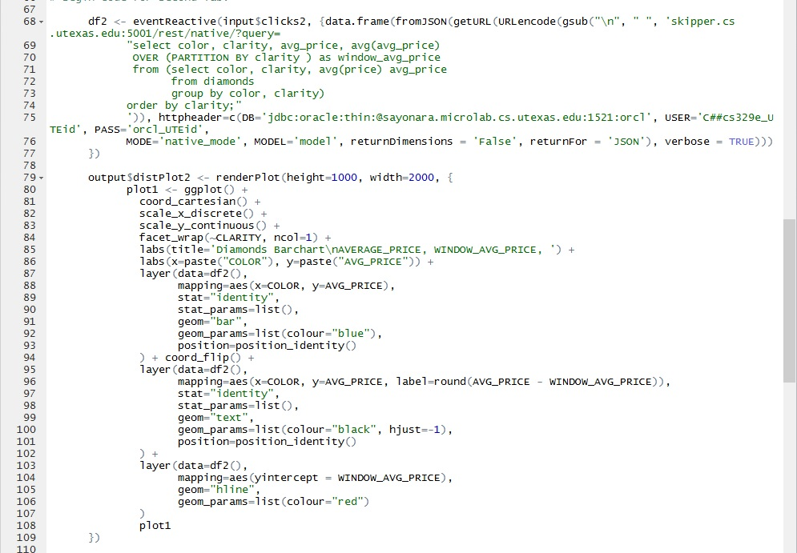
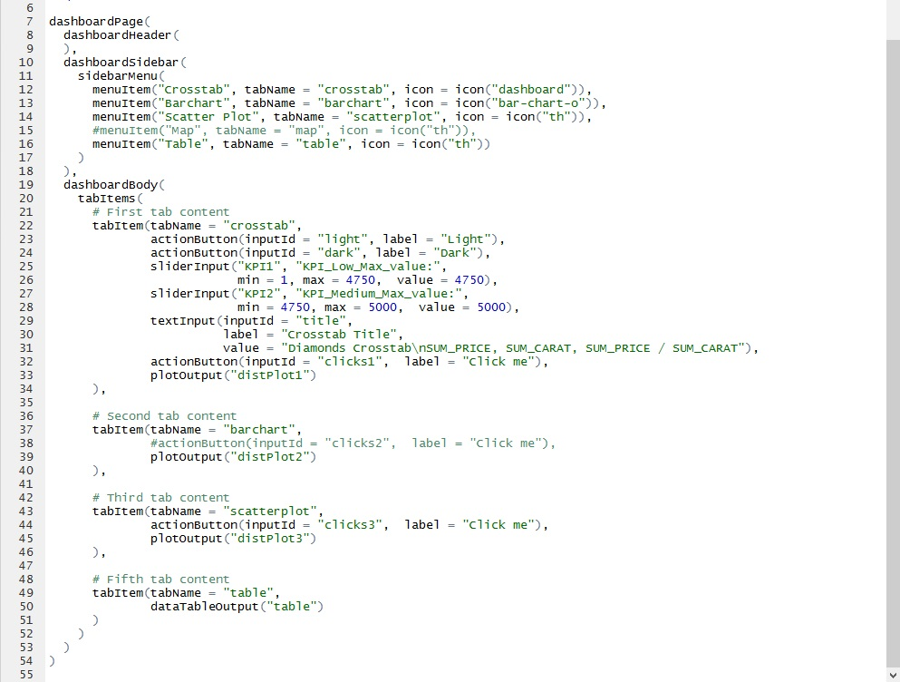

# Creating Shiny Apps

## Steps to Reproduce 
1. Get data set
2. Use ELT.R to clean up the data

3. Create table in SQL Developer

4. Import data to table

5. Create appropriate crosstab, barchart, and scatter plot data frames and ggplots
6. Move the data frame and ggplot function into a Shiny server.R file

7. Make adjustments to the ui.R file

8. Go back to server.R and hit the Run App button to create a Shiny App

## Global Economic Data
"The Penn World table contains national income and purchasing power data for 189 countries and territories for available years between 1950 and 2009. The data has been converted into common currency and its updated on an annual basis. Funding for this research is provided by the National Science Foundation (NSF)."  

## Global Economics ShinyApps Link
https://ronly.shinyapps.io/DV_SProject

#Analysis of Global Economics on ShinyApps
##Bar Charts

* Columns: SUM(Consumption Percentage of Real GDP)  
* Rows: Country  
* Filters: Year: 2009  
* Label: SUM(Consumption Percentage of Real GDP)

* The average consumption percentage of GDP is 70% for 2009, the year after the stock market crash. 
* Equatorial Guinea had a consumption percentage of 9.5% of their GDP, while Liberia had a percentage of 192.4%.  

## Scatter Plots 

* Columns: Population  
* Rows: Real GDP  
* Filters: Population: 7-266,859; Color: Year  
* Label: Country  

* The color ranged from red to green, 1950 to 2009 respectively. Using these colors, the visualizations depict the population and Real GDP growth rates over time.  
* Italy, France, and Germany's population growth rates plateaued around the 1980s.  
* Japan's Real GDP rate increased more significatly than any other country in this population range.  
* Pakistan and Indonisia's population rate are continuing to grow, while their economies did not not expand as much as the other countries.  

## Cross Tabs

* Columns: Year  
* Rows: Country  
* Filters: Year: 2001-2009, Color: AGG(KPI)  
* Label: Real Gross Domestic Income  

* Real Gross Domestic Income of countries from 2001-2009.  
* Low Key Performance Indicator (Real Gross Domestic Income) <= $1,930.22  
* Medium Key Performance Indicator (Real Gross Domestic Income) <= $7108.52  
* High Key Performance Indicator (Real Gross Domestic Income) > $7108.52  
* Azerbaijan's real gross domestic income tripled in under a decade.  
* Belarus' real gross domestic income doubled in under a decade.  

*The new columns start with "Country_Isocode"

Citation:
https://app.enigma.io/table/edu.upenn.econ.pwt?row=0&col=30&page=1
